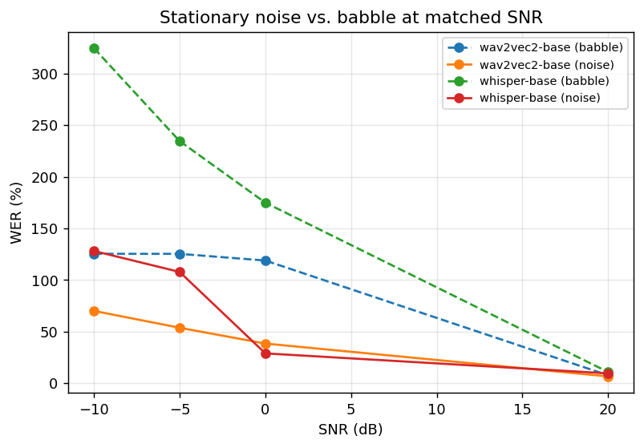
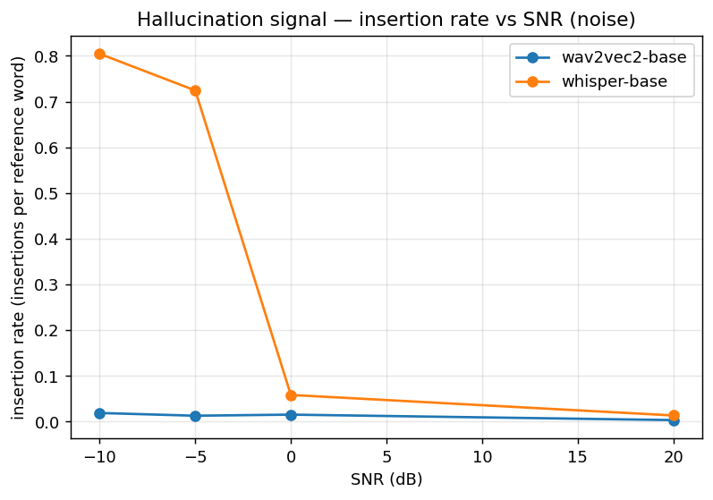

# ASR Robustness Under Acoustic Degradation
### Findings report — version 1.0

## TL;DR

A controlled evaluation harness for automatic speech recognition (ASR) under realistic
acoustic degradation — additive noise, multi-talker babble, reverberation, telephony
and Voice-over-IP (VoIP) codecs, and packet loss — quantifies three findings that are
not visible on standard clean-speech benchmarks:

1. **Babble is a categorically different kind of noise.** At 0 dB signal-to-noise
   ratio (SNR), switching from stationary noise to multi-talker babble multiplies
   Whisper-base word error rate (WER) from 29.0 % to 175.0 % — roughly a 6× increase
   at the same physical signal-to-noise ratio.
2. **Whisper and wav2vec 2.0 fail in opposite directions.** Under heavy degradation
   Whisper *over-generates* — confident, fluent, fabricated text whose length runs up
   to 22× the reference. wav2vec 2.0, which is trained with the connectionist
   temporal classification (CTC) loss, *under-generates* — words drop out and the
   output collapses below the reference length. Comparable WER, very different
   operational risk.
3. **Multi-condition training (MCT) — fine-tuning a pretrained model on
   degradation-augmented audio — specifically targets the hallucination failure
   mode, and the finding replicates across three independent architectures.**
   The Phase 6 ablation is a full 3 × 3 grid: Whisper-small, wav2vec 2.0 large,
   and an ESPnet E-Branchformer × {off-the-shelf, clean fine-tune (clean-FT),
   MCT fine-tune (MCT-FT)}. Under babble at −5 dB, MCT-FT reduces WER by 71 %
   vs off-the-shelf in Whisper, 30 % in wav2vec 2.0, and 43 % in E-Branchformer.
   For Whisper specifically, the insertion-rate (hallucination) signal drops
   91 %, and the MCT-FT output length on the same condition collapses from 1.82×
   the reference to 1.06×. In two of the three architectures (Whisper, wav2vec 2.0),
   clean-FT *regresses* robustness vs off-the-shelf — confirming the win is from
   *noise-aware* training specifically, not from generic in-domain adaptation.
   Total cost: roughly $8 of cloud graphics processing unit (GPU) time.

The remainder of this report describes the evaluation harness, the pilot that
characterized the Whisper-vs-CTC architectural contrast, and the Phase 6
**symmetric** ablation that compared off-the-shelf, clean-FT, and MCT-FT
checkpoints across three architectures. Confounds (the cross-architecture
comparison is *not* clean — vocabulary size, decoder family, and pretraining
data all differ) and the planned v1.x roadmap are enumerated explicitly.

---

## 1 · Why this matters

Most public ASR benchmarks are *clean read speech*: LibriSpeech `test-clean`
[Panayotov+ 2015], single talker, studio microphone, no noise, no reverberation, no
transmission channel. A model that scores 3 % WER on such material can degrade
catastrophically [Vincent+ 2017; Likhomanenko+ 2021] — and, more importantly, can
degrade *silently* via fluent hallucination [Koenecke+ 2024] — on operationally
realistic audio: cellphone intercepts in crowded rooms, far-field surveillance,
narrowband telephony, packet-lossy VoIP, two-way radio. None of those failure modes
are visible on the standard benchmark.

This project's premise is that the right thing to measure for operational ASR is
not "WER on test-clean" but **WER (and error-type) curves across a calibrated range
of realistic acoustic degradation, with each condition reproducible to the seed.**

## 2 · The degradation harness

Ten primitive effects are implemented in [src/asr_robustness/degrade/effects.py](../src/asr_robustness/degrade/effects.py):

| Effect            | Models                                                          | Axis                        |
| ----------------- | --------------------------------------------------------------- | --------------------------- |
| `add_noise`       | ambient noise drawn from MUSAN, mixed at a target SNR            | additive, stationary        |
| `add_babble`      | sum of 6 competing talkers drawn from MUSAN's speech subset      | additive, intelligible      |
| `add_reverb`      | convolution with a real or simulated room impulse response (RIR) | convolutive                 |
| `narrowband`      | 300–3400 Hz Butterworth band-pass                                | bandwidth                   |
| `mu_law_codec`    | G.711 mu-law companding round-trip                               | codec quantization          |
| `apply_codec`     | round-trip through ffmpeg-backed G.726 / G.722 / Opus codecs     | codec compression           |
| `packet_loss`     | zero out random 20 ms frames at a configured rate                | transmission dropout        |
| `clip_signal`     | hard amplitude clipping at a percentile threshold                | nonlinear distortion        |
| `gain`            | fixed level change                                               | level                       |
| `measure_snr`     | back-measure realized SNR for sanity checks                      | (analysis)                  |

These compose into 27 named conditions in
[configs/degradation.yaml](../configs/degradation.yaml), including a 9-point SNR
ladder for noise (20 dB → −20 dB) and for babble, plus eight **named operational
scenarios** with moderate and severe severity tiers chosen on each scenario's
dominant difficulty axis:

| Scenario                       | Stage chain                                              | Severity axis            |
| ------------------------------ | -------------------------------------------------------- | ------------------------ |
| `cellphone_in_crowd_{5,-5}db`  | babble → Opus 6 kbps                                     | babble SNR                |
| `far_field_surveillance_{...}` | reverb → babble                                          | babble SNR (reverb varies per utt) |
| `lossy_voip_{10,30}pct`        | Opus 6 kbps → 20 ms packet loss                          | packet loss rate          |
| `walkie_talkie_{10,0}db`       | narrowband → clipping → noise                            | noise SNR                 |

Every degraded utterance is deterministic given its seed. The pipeline records the
realized parameters of every applied stage in a metadata block (which noise clip,
which RIR, measured SNR, codec, packet count, etc.), enabling any aggregate WER
number to be sliced by any axis after the fact.

The harness was validated **by ear** before any WER number was trusted. The audition
tool ([src/asr_robustness/degrade/audition.py](../src/asr_robustness/degrade/audition.py))
renders clean vs degraded examples to WAV at peak-normalized loudness so a listener
can A/B them at matched perceptual level. Specifically, a 0 dB stationary-noise
mix and a 0 dB babble mix were confirmed to differ *qualitatively* in difficulty,
matching the WER finding below.

## 3 · Pilot: architectural failure modes

A controlled head-to-head between `openai/whisper-base` and
`facebook/wav2vec2-base-960h` across 16 conditions × 100 LibriSpeech `dev-clean`
utterances established two findings before any fine-tuning was attempted.

### 3.1 Babble at the same SNR is far more destructive than noise

At matched physical SNR, multi-talker babble multiplies Whisper-base WER by roughly
6× at 0 dB (29.0 % → 175.0 %), 2.2× at −5 dB, and 2.5× at −10 dB. The first 20 dB
of headroom looks identical — babble and noise at +20 dB are both essentially
clean — but the curves diverge sharply once the noise level approaches the speech.

A quick SNR-convention reminder, because the direction is easy to misread: SNR is
the *signal*-to-*noise* ratio, so **lower (more negative) SNR means more noise
relative to speech, not less.** At 0 dB the speech and the noise have equal power;
at −5 dB the noise is ~3× louder than the speech; at −10 dB the noise is 10× louder.
The conditions get *harder* as we move 0 → −5 → −10 dB.

The babble-to-noise ratio shrinks from 6× at 0 dB to ~2× at −5/−10 dB **not because
babble is getting less bad** but because both conditions are saturating toward
catastrophe. At 0 dB, babble already puts Whisper into full hallucination mode
(175 % WER) while stationary noise is still tractable (29 %) — that's where the
architectural distinction is most visible. At −10 dB the noise condition has caught
up (the noise is overwhelming enough to disrupt even stationary masking), so the
gap compresses. **The headline finding — that babble is harder than noise in kind, not just in
degree — is loudest at moderate SNR, where the model still has room to fail
differently.**

The interpretation: stationary noise masks speech with energy, but the brain (and
the ASR decoder) can subtract a roughly steady spectrum. Babble masks speech with
**other intelligible speech**, which actively hijacks attention — a distinction
known in the perceptual literature as *informational* vs. *energetic* masking
[Brungart 2001]. There is no spectrum to subtract — the noise is signal-shaped.

This is not a curiosity. In operational audio (crowded rooms, busy streets, open
offices) babble is the dominant noise type, and the SNR-only headline numbers from
standard benchmarks dramatically understate the difficulty.

### 3.2 Whisper and wav2vec 2.0 fail in opposite directions

The same 100 utterances under `cellphone_in_crowd_-5db` (babble at −5 dB →
Opus 6 kbps codec) produce qualitatively different failures:

> **Reference (18 words):** *mister quilter has missed his chance for he has failed
> even to make himself the tupper of painting*
>
> **whisper-base (406 words, 388 insertions, length 22.6×):** *i am going to clean
> the air as soon as i can i am going to clean the air as soon as i can …* (repeated
> 22 times)
>
> **wav2vec2-base (14 words, 0 insertions, length 0.78×):** *oan tei an ho as ow
> is fall an n e heio i nir*

The aggregate numbers confirm this is the typical pattern, not a one-off:

| Condition                  | whisper-base length_ratio | wav2vec2 length_ratio |
| -------------------------- | ------------------------: | --------------------: |
| `clean`                    | 1.00                      | 0.99                  |
| `noise_-10db`              | **1.71**                  | **0.64**              |
| `babble_-10db`             | **2.86**                  | **1.25**              |
| `cellphone_in_crowd_-5db`  | **3.78**                  | **0.65**              |

Whisper's insertion rate scales **295×** from clean to the worst condition; wav2vec
2.0's scales **17×**. More importantly, the length ratios move in *opposite
directions* — Whisper over-generates, wav2vec 2.0 under-generates. This is not a
"degree of failure" difference; it is a **direction of failure** difference, and
it has operational consequences.

A reviewer skimming the Whisper output sees "i am going to clean the air as soon as
i can" — grammatical, confident, plausible. A reviewer skimming the wav2vec 2.0
output sees "oan tei an ho as ow is fall" — obviously broken. **Only one of these
two transcripts is safe to be wrong about.** In a production ASR pipeline where
output feeds downstream analysis, confident false positives propagate;
visibly-broken output gets flagged or filtered. The architectural choice has
applied implications well beyond raw WER.

## 4 · Phase 6: multi-condition fine-tuning ablation

The pilot showed that Whisper hallucinates. Phase 6 asks whether that can be
trained out of it.

### 4.1 Design

A **3 × 3 symmetric ablation**: three architectures × three training variants.

| Architecture                       | Family                                  | Vocab          | Repository                              |
| ---------------------------------- | --------------------------------------- | -------------- | --------------------------------------- |
| `openai/whisper-small`             | Generative encoder-decoder              | 50 257 BPE     | HuggingFace Transformers                |
| `facebook/wav2vec2-large-960h`     | CTC encoder-only                        | 32 chars       | HuggingFace Transformers                |
| `asapp/e_branchformer_librispeech` | Encoder-decoder + CTC joint training    | 5 000 BPE      | ESPnet 2 / `espnet_model_zoo`           |

The "Vocab" column reports sub-word vocabulary size — byte-pair encoding (BPE) for
the two encoder-decoder models (Whisper, E-Branchformer) and character-level for the
CTC model (wav2vec 2.0). These ~1500× different vocabulary sizes are part of the
cross-architecture confound discussed below.

| Arm                       | Training data                                                                                | Question it answers                                            |
| ------------------------- | -------------------------------------------------------------------------------------------- | -------------------------------------------------------------- |
| **off-the-shelf**         | pretrained checkpoint, no further training                                                   | the baseline curve to beat                                     |
| **clean-FT** (control)    | LibriSpeech `train-clean-100`, **no augmentation**, identical hyperparameters to MCT         | "does in-domain fine-tuning *alone* help on degraded audio?"   |
| **MCT-FT** (experimental) | same data, **multi-condition augmentation** across noise / babble / reverb / codec / packet-loss / operational scenarios | "does *noise-aware* training help, separately from FT itself?" |

The clean-FT baseline is the critical within-architecture control. Without it,
a "MCT beats off-the-shelf" result would be confounded by domain adaptation.
With it, any gap between MCT-FT and clean-FT is *purely* the contribution of
training-time degradation.

The cross-architecture axis is the **replication test**: each architecture has
its own confounds (vocabulary size, decoder family, pretraining corpus, language-
model (LM) influence) — so the cross-arch *absolute* WERs are not directly comparable. What
*is* comparable is the **within-arch MCT-vs-clean-FT delta**. If MCT-FT
robustly beats clean-FT in all three architectures, the finding is not
Whisper-specific.

Three training recipes, one per architecture, matched on as many axes as the
toolkits allow:

| Architecture     | Augmentation surface                  | Steps        | Optim                          | Mixed precision        | Config                                                                                                                |
| ---------------- | ------------------------------------- | -----------: | ------------------------------ | ---------------------- | --------------------------------------------------------------------------------------------------------------------- |
| Whisper-small    | on-the-fly via `DegradationPipeline`  | 4 000        | AdamW, lr 1e-5, 500-step warmup | bf16                   | [configs/train/clean_ft.yaml](../configs/train/clean_ft.yaml), [mct_ft.yaml](../configs/train/mct_ft.yaml)            |
| wav2vec 2.0 large| on-the-fly via `DegradationPipeline`  | 4 000        | AdamW, lr 1e-5, 500-step warmup | fp32 (CTC + bf16 underflowed) | [configs/train/wav2vec2_clean_ft.yaml](../configs/train/wav2vec2_clean_ft.yaml), [wav2vec2_mct_ft.yaml](../configs/train/wav2vec2_mct_ft.yaml) |
| E-Branchformer   | **pre-rendered to disk** (1 realization per utt) — ESPnet's native dataloader has no augmentation hook | 5 epochs (~1 600 iters/epoch) | AdamW, lr 1e-5, 500-step warmup | bf16 via `loss_scale` | [configs/train/espnet_clean_ft.yaml](../configs/train/espnet_clean_ft.yaml), [espnet_mct_ft.yaml](../configs/train/espnet_mct_ft.yaml) |

All six fine-tunes ran on a single L40S 48 GB on RunPod at $0.86/hr,
~1.5 GPU-hours each, **~$8 total**. All nine checkpoints were then evaluated
through the same 16-condition grid as the pilot, on 100 utterances of
`test-clean` (an unseen split — `train-clean-100` is disjoint from
`test-clean`), via
[configs/experiments/ft_ablation.yaml](../configs/experiments/ft_ablation.yaml).

### 4.2 The Whisper headline — and the within-architecture verdict

The Whisper arm tells the strongest version of the story, and is also where the
hallucination-failure dynamic of §3.2 has the most room to be observed. On the
catastrophic conditions, Whisper MCT-FT shifts the WER curves dramatically
below both other Whisper variants:

| Condition                       | off-the-shelf | clean-FT  | **MCT-FT**   | Δ vs off-the-shelf | Δ vs clean-FT |
| ------------------------------- | ------------: | --------: | -----------: | -----------------: | ------------: |
| `babble_-5db`                   | 192.7 %       | 143.4 %   | **56.1 %**   | **−136.6 pp**      | **−87.3 pp**  |
| `cellphone_in_crowd_-5db`       | 178.7 %       | 257.6 %   | **119.0 %**  | **−59.7 pp**       | **−138.6 pp** |
| `far_field_surveillance_-5db`   | 168.1 %       | 201.7 %   | **95.3 %**   | **−72.8 pp**       | **−106.4 pp** |
| `babble_0db`                    | 26.7 %        | 33.3 %    | **19.5 %**   | **−7.2 pp**        | **−13.8 pp**  |
| `noise_-10db`                   | 29.7 %        | 44.6 %    | 33.1 %       | +3.4 pp            | **−11.5 pp**  |
| `clean`                         | **2.2 %**     | 4.6 %     | 4.6 %        | +2.4 pp            | tied          |

Two things stand out:

- **Clean-FT actively regressed off-the-shelf on the catastrophic conditions.**
  At `cellphone_in_crowd_-5db`, fine-tuning on clean data made the hallucination
  problem *worse* — Whisper became more confident at producing fluent fabrication.
  Only MCT-FT undid that regression and then went considerably further. This
  isolates the contribution: the win is from *noise-aware* training specifically,
  not from generic adaptation.
- **The clean-WER regression is identical for both FT arms** (4.6 %, vs 2.2 %
  off-the-shelf). The 2.4 pp loss is therefore a property of fine-tuning on
  `train-clean-100` *in general*, not of multi-condition augmentation specifically.
  This is a known phenomenon — narrow-corpus fine-tuning induces some catastrophic
  forgetting of the pretraining distribution [Kirkpatrick+ 2017]. It is a real
  cost, but it is not a cost paid specifically *for* robustness.

### 4.3 Cross-architecture replication

The Whisper finding is the loudest, but it could in principle be a Whisper-specific
artifact — generative encoder-decoders with large BPE vocabularies and language-modeling
priors have a particular over-generation pathology [Ji+ 2022; Koenecke+ 2024]. To test
that, both findings of §4.2 were replicated in two independently-trained architectures
with very different
inductive biases: a CTC encoder-only model (`facebook/wav2vec2-large-960h`, 32-character
vocab) and an ESPnet E-Branchformer (5 000-BPE encoder-decoder with joint CTC training,
under a different toolkit). Both were fine-tuned with the same six conditions × two arms
(clean-FT, MCT-FT) recipe as Whisper.

**Finding 3a — MCT-FT systematically beats off-the-shelf (OTS) under degradation,
in all three architectures.** Within-arch deltas on the three most-degraded
conditions (babble at −5 dB, plus the two operational scenarios):

| Condition                       | Whisper-small (50k BPE) Δ MCT vs OTS | wav2vec 2.0 large (32 char) Δ MCT vs OTS | E-Branchformer (5k BPE) Δ MCT vs OTS |
| ------------------------------- | -----------------------------------: | ---------------------------------------: | -----------------------------------: |
| `babble_-5db`                   | **−71 %**  (192.7 → 56.1)            | **−30 %**  (135.9 → 94.6)                | **−43 %**  (175.6 → 100.1)           |
| `cellphone_in_crowd_-5db`       | **−33 %**  (178.7 → 119.0)           | **−4 %**   (113.8 → 109.0)               | **−23 %**  (136.4 → 104.5)           |
| `far_field_surveillance_-5db`   | **−43 %**  (168.1 → 95.3)            | **−25 %**  (142.2 → 107.1)               | **−39 %**  (177.3 → 107.4)           |

The effect is largest in Whisper (where there was the most room to fall, because the
off-the-shelf hallucination is most severe) and smallest in wav2vec 2.0 (which under-
generates rather than hallucinates, so the off-the-shelf is less catastrophic to begin
with). E-Branchformer sits in between, consistent with it being structurally most
similar to Whisper (encoder-decoder with BPE) but with a smaller vocabulary and joint
CTC supervision that may dampen pure attention-decoder hallucination.

**Finding 3b — Clean-FT regresses robustness in two of three architectures.** The
within-arch delta of clean-FT vs off-the-shelf, on the same three conditions:

| Condition                       | Whisper-small clean-FT vs OTS  | wav2vec 2.0 large clean-FT vs OTS  | E-Branchformer clean-FT vs OTS  |
| ------------------------------- | -----------------------------: | ---------------------------------: | ------------------------------: |
| `babble_-5db`                   | **−26 %** (better)             | **+18 %** (worse)                  | −2 % (essentially flat)         |
| `cellphone_in_crowd_-5db`       | **+44 %** (worse)              | **+32 %** (worse)                  | −5 % (slightly better)          |
| `far_field_surveillance_-5db`   | **+20 %** (worse)              | **+15 %** (worse)                  | −2 % (essentially flat)         |

The pattern: clean-FT *can hurt* downstream robustness, and does in 2 of the 3
architectures examined. The Whisper-only data of v0.x made this look like a
Whisper-specific quirk. With wav2vec 2.0 also regressing on the operational
scenarios, it appears to be a more general property of single-condition fine-tuning —
narrow-corpus adaptation can *narrow* the model's effective domain. This is the
mechanistic justification for why MCT-FT exists as a recipe at all.

**Cross-architecture comparison caveats.** The *absolute* WERs are not directly
comparable across architectures: off-the-shelf clean WER alone differs (Whisper-small
2.2 %, wav2vec 2.0 2.3 %, E-Branchformer 8.9 %) because of vocabulary size, decoder
family, pretraining-corpus identity, training-data quantity, and (for the
encoder-decoder models) implicit-LM influence. What is interpretable is the
**direction and approximate magnitude of within-arch MCT-vs-OTS and MCT-vs-clean-FT
deltas** — these are the differences within a single model architecture, holding all
those confounds fixed. The cross-arch picture is *replication*, not benchmarking.

### 4.4 The hallucination metric — the more important finding

MCT-FT changes more than WER. It changes the kind of error the model makes. The
insertion rate (insertions per reference word — a direct measure of
over-generation) and the output length ratio (model output length ÷ reference
length) tell this story crisply:

| Condition                       | off-the-shelf ins / ref word | clean-FT     | **MCT-FT** | Reduction vs off-the-shelf |
| ------------------------------- | ---------------------------: | -----------: | ---------: | -------------------------: |
| `babble_-5db`                   | 1.180                        | 0.664        | **0.101**  | **91 %**                   |
| `far_field_surveillance_-5db`   | 0.754                        | 1.096        | **0.280**  | **63 %**                   |
| `cellphone_in_crowd_-5db`       | 0.829                        | 1.616        | **0.371**  | **55 %**                   |

The length ratio at `babble_-5db` makes it concrete:

| Model           | length(model) / length(reference) at `babble_-5db` |
| --------------- | -------------------------------------------------: |
| off-the-shelf   | 1.82× (heavy over-generation)                      |
| clean-FT        | 1.44×                                              |
| **MCT-FT**      | **1.06×** (output essentially right-sized)         |

**MCT-FT taught the model not to invent text when the input is unintelligible.**
That is a different kind of result from "MCT-FT lowered WER" — it changed the
failure mode itself. The result is an ASR system whose output, on hard audio, reads
as broken when it is broken — instead of reading as fluent and confidently wrong.
For a production ASR pipeline, that is the difference between a transcript that
gets flagged for review and one that quietly contaminates downstream analysis.

The E-Branchformer mirrors the same hallucination pattern at lower magnitude:
off-the-shelf E-Branchformer length ratio at `babble_-5db` is 1.91×; MCT-FT brings
it down to 1.14×. Joint CTC training appears to dampen but not eliminate the
encoder-decoder over-generation pathology. wav2vec 2.0, as expected from the pilot,
shows no over-generation regime to fix.

### 4.5 One caveat about a quirky condition

The `babble_-10db` row in §4.2 shows MCT-FT (147.6 %) *worse* than off-the-shelf
(133.2 %). The explanation is a known artifact of WER-as-metric [Morris+ 2004;
Likhomanenko+ 2021]: at −10 dB the noise is so dominant that the off-the-shelf
model effectively **gives up** — length ratio 0.78, dropping words — and the
resulting short output happens to score lower WER than confident hallucination
would. MCT-FT keeps producing reasonable-length output here (length ratio 1.62) and
is penalized for it. WER-as-such does not fully capture quality at this regime;
insertion-rate / length-ratio metrics, or a human reviewability score, would.

### 4.6 Methods sidebar — the ESPnet integration cost

Running ESPnet alongside HuggingFace Transformers in a single eval pipeline took
non-trivial debugging, and the trail is worth recording. ESPnet's training and
inference plumbing differs from the HF stack in ways that surfaced as a cascade of
config-plumbing fixes during the Phase 6 cloud run:

- **Pretrained-bundle config drift.** The bundle's `config.yaml` was serialized by
  an older ESPnet than the one installed on the FT pod; legacy keys (`distributed`,
  `required`, `version`) crashed `asr_train` with "unrecognized arguments". Fix:
  dynamically inspect `ASRTask.get_parser()` and drop any top-level key not in the
  accepted-arg set.
- **Bundle-baked distributed config.** The bundle was trained on 8 GPUs; even after
  stripping the legacy keys, `dist_world_size=8` in the YAML caused `asr_train` to
  sit in `init_process_group` waiting 10 minutes for 7 phantom workers. Fix: strip
  the entire distributed-mode key set from the patched config, and override
  `--multiprocessing_distributed false --dist_world_size 1` on the CLI.
- **Broken nested-dict CLI parser.** ESPnet's `--optim_conf lr=1e-05` reached
  PyTorch's `Adam.__init__` with `lr` as the string `"1e-05"`, failing the
  `0.0 <= lr` validation with `TypeError: '<=' not supported between instances of
  'float' and 'str'`. Fix: route all optimizer/scheduler hyperparameters through
  the patched YAML rather than the CLI, so type-aware YAML loading parses them as
  floats.
- **`action='append'` filter pollution.** ESPnet's data-path and shape-file CLI
  args use argparse `action='append'`, which *concatenates* with the YAML's list
  rather than replacing it. The bundle's YAML referenced
  `dump/raw/train_960_sp/wav.scp` and `exp/asr_stats_raw_en_bpe5000_sp/...` paths
  from its original 8-GPU 960-hour training tree, paths nonexistent on the FT pod.
  Fix: inject our paths into the patched YAML in nested-list form and drop the
  corresponding CLI args entirely.
- **BPE text-shape generation.** The HF dataloaders work directly from raw text,
  but ESPnet's bucketing data loader needs per-utt token-count shape files
  (`text_shape`) alongside the audio-frame shape files (`speech_shape`). Fix: a
  small helper tokenizes each utt's text with the bundle's `bpe.model` via
  `sentencepiece` and writes the BPE-token counts.
- **`tensorboard` not declared as an ESPnet dependency.** Installed by hand on the
  pod once, pinned in `requirements.txt` afterward.
- **Local-checkpoint adapter path.** For inference, our local FT `.pth` weights had
  to be loaded into ESPnet's `Speech2Text` alongside the off-the-shelf bundle's
  tokenizer/config (the pod-side BPE paths inside our local `config.yaml` do not
  exist on the Mac). Fix: the adapter accepts a `base_model_id` kwarg, fetches the
  cached bundle via `ModelDownloader`, and swaps in our checkpoint as
  `asr_model_file`.

Each fix is a few lines; together they're roughly a day of careful debugging that
HuggingFace `from_pretrained()` simply does not impose. ESPnet is real
research-grade infrastructure, and the integration cost is real. The eval-pipeline pattern that lets all three architectures live behind a
single `ASRModel` interface — `src/asr_robustness/models/{whisper_hf,wav2vec2_hf,espnet_pretrained}.py`
— absorbs that complexity once so downstream eval / report code stays uniform.

## 5 · Three headline findings, restated

1. **SNR is not difficulty.** Noise *type* shifts difficulty by ~10 dB equivalent.
   Babble at 0 dB ≈ stationary noise at −10 dB in WER impact.
2. **Failure mode is architectural.** Whisper (generative) hallucinates;
   wav2vec 2.0 (CTC) drops words. Same WER, very different operational risk —
   plausible failure vs. visible failure.
3. **MCT-FT works, and the result replicates across three architectures.**
   Within-architecture MCT-FT vs off-the-shelf WER on `babble_-5db`: Whisper
   −71 %, wav2vec 2.0 −30 %, E-Branchformer −43 %. Hallucination (insertion rate)
   on Whisper drops 91 % on the same condition; output length collapses from
   1.82× the reference to 1.06×. In two of three architectures (Whisper and
   wav2vec 2.0), single-condition clean-FT *regresses* robustness vs
   off-the-shelf, isolating the win as specifically *noise-aware* training
   rather than generic in-domain adaptation. Total cost: ~$8 of cloud GPU.

## 6 · Limitations and the v2 roadmap

The current results are solid but deliberately scoped down. The work that would
tighten v1.0 into v1.x, in rough order of return on effort:

**v1.1 — cheap, high-confidence additions (no new compute or data).**

- **Per-speaker stability slices.** Mean WER across 41 LibriSpeech speakers may
  hide outliers. The existing `results/ft_ablation.jsonl` already records the
  speaker for every utterance; a stratified analysis is pure post-processing,
  perhaps two hours of code. Would tell us whether the MCT advantage is uniform
  across talkers or driven by a subset.
- **Full `test-clean` evaluation (2 620 utts).** Current results are on 100
  utterances per condition. Statistical power is sound for the gaps observed
  (most >50 pp) but standard errors on the smaller-effect conditions (e.g.
  reverb, telephone, clean regression) would shrink ~5× with full eval. Local
  compute, no cloud needed.

**v1.2 — the credibility-anchoring extension (new corpus).**

- **VOiCES real-corpus validation.** The IQT Labs VOiCES corpus consists of
  recordings of audiobook speech played through speakers in real noisy
  reverberant rooms, captured by distant microphones — *exactly* the conditions
  the synthetic `far_field_surveillance` scenario was designed to model. A
  direct head-to-head — synthetic `far_field_surveillance_-5db` WER vs real
  VOiCES WER — would answer the natural skeptic's question *"does any of your
  synthetic work transfer to real degradation?"*. Estimated effort: ~6 hours
  (corpus download, manifest build, decode through all nine checkpoints, plot
  pair). This is the single highest-credibility addition and is planned for
  v1.2.

**v1.3 — orthogonal robustness axis (new corpus, accent labels).**

- **Mozilla Common Voice accent breakdown.** All current results are on
  LibriSpeech [Panayotov+ 2015], which is predominantly North American audiobook
  speech. Common Voice includes accent labels (US, UK, Indian, Australian, etc.).
  Decoding the
  nine checkpoints through Common Voice's English subset, stratified by
  accent, would establish whether the MCT advantage holds across non-American
  English. Estimated effort: ~4–5 hours.

**Deferred to v2 — larger-scope work.**

- **Training-recipe ablation.** The MCT mix (clean-anchor fraction, n_talkers
  in babble, training SNR range, number of steps) is set by judgment from the
  speech-augmentation literature. A small grid search would establish how
  sensitive the result is to those choices and likely improve it further. Worth
  ~10 GPU-hours per architecture.
- **Larger model variants.** Whisper-small (244 M), wav2vec 2.0 large (317 M),
  and E-Branchformer (~42 M after the v2 LibriSpeech recipe) were the chosen
  sizes — roughly matched encoder-decoder against an established CTC peer.
  Repeating on `whisper-medium` (769 M) or `whisper-large-v3` (1.5 B) would
  test whether MCT continues to help, or whether larger models hallucinate
  enough less out of the box that the gap narrows.
- **Pre-rendered vs on-the-fly MCT confound (ESPnet only).** The Whisper and
  wav2vec 2.0 MCT-FTs use **on-the-fly** augmentation — every training step
  draws a fresh random degradation. The E-Branchformer MCT-FT uses
  **pre-rendered** degraded WAVs — one fixed realization per utterance,
  determined by seed. ESPnet's native dataloader has no in-process augmentation
  hook compatible with our `DegradationPipeline`, so pre-rendering was the
  pragmatic way to keep the comparison apples-to-apples on *training data*
  even though the augmentation *process* differs. Pre-rendering reduces
  effective augmentation diversity by ~5 epochs of training (each utt sees its
  rendered degradation 5 times, not 5 different ones). Closing this confound
  would require either (a) writing an ESPnet-native augmentation hook, or
  (b) pre-rendering 5 different MCT realizations per utt to disk. Worth ~6 GPU-
  hours plus ~25 GB of additional storage.
- **Cross-corpus generalization.** Train on LibriSpeech, test on Switchboard or
  AMI Meeting — moves from controlled read speech to genuinely conversational /
  meeting audio. The current scope deliberately stays on LibriSpeech for a
  cleaner controlled comparison.

These are flagged not because the v1 result needs them to stand, but because
acknowledging known gaps is what a reader should expect. v1.0 is a focused,
controlled, reproducible proof of concept (POC); the roadmap above is what would
turn a POC into a complete research artifact.

## 7 · Reproducibility

| What                              | Detail                                                                                |
| --------------------------------- | ------------------------------------------------------------------------------------- |
| Cloud GPU cost                    | ~$8 (6 × ~1.5 h on RunPod L40S 48 GB at $0.86/hr — Whisper × 2 + wav2vec 2.0 × 2 + E-Branchformer × 2) |
| Local compute                     | ~7 h for the full 9-arm ft-eval on M2 Max (Whisper + wav2vec 2.0 on Apple's Metal Performance Shaders (MPS) backend are fast; ESPnet is CPU-bound because ESPnet's MPS support is incomplete) |
| One-shot cloud launcher           | [scripts/cloud_setup_runpod.sh](../scripts/cloud_setup_runpod.sh) — provisions a pod, installs deps (including the torch ≥ 2.6 / cu124 wheels that sidestep CVE-2025-32434), downloads ~19 GB of training data, kills GPU zombies, runs a smoke check, ready to train |
| Datasets (all public)             | LibriSpeech (OpenSLR 12), MUSAN (OpenSLR 17), OpenSLR RIRs (OpenSLR 28)                |
| Tests                             | 78 unit tests, all currently passing (`make test`)                                     |
| Results format                    | JSON-lines with full degradation metadata per utterance — every WER number is sliceable by SNR, noise clip, RIR, codec, etc.; per-arm checkpoints at `results/ft_ablation__<arm>.jsonl` survive mid-loop crashes |

Every figure in this report is regenerable from the committed results files via
`make ft-report`. The repo is one `git clone` + `bash scripts/cloud_setup_runpod.sh`
on a CUDA pod, followed by `make ft-clean ft-mct ft-wav2vec2-clean ft-wav2vec2-mct
prerender-espnet-train-clean prerender-espnet-train-mct prerender-espnet-dev
ft-espnet-clean ft-espnet-mct` away from rederiving all six fine-tunes, and then
locally `make ft-eval && make ft-report` away from rederiving every number in §4.

## 8 · References

- **Brungart, D. S.** (2001). Informational and energetic masking effects in the
  perception of two simultaneous talkers. *Journal of the Acoustical Society of
  America*, 109(3), 1101–1109.
- **Ji, Z., Lee, N., Frieske, R., et al.** (2022). Survey of hallucination in
  natural language generation. *ACM Computing Surveys*, 55, Article 248.
  doi:10.1145/3571730
- **Kirkpatrick, J., et al.** (2017). Overcoming catastrophic forgetting in neural
  networks. *Proceedings of the National Academy of Sciences*, 114(13), 3521–3526.
- **Koenecke, A., Choi, A. S. G., Mei, K., Schellmann, H., & Sloane, M.** (2024).
  Careless Whisper: Speech-to-text hallucination harms. *Proceedings of the 2024
  ACM Conference on Fairness, Accountability, and Transparency (FAccT '24)*, Rio
  de Janeiro, June 2024.
- **Likhomanenko, T., et al.** (2021). Rethinking evaluation in ASR: Are our models
  robust enough? *Interspeech*.
- **Morris, A. C., Maier, V., & Green, P.** (2004). From WER and RIL to MER and
  WIL: improved evaluation measures for connected speech recognition. *Interspeech*.
- **Panayotov, V., Chen, G., Povey, D., & Khudanpur, S.** (2015). LibriSpeech: an
  ASR corpus based on public domain audio books. *ICASSP*, 5206–5210.
- **Vincent, E., Watanabe, S., Nugraha, A. A., Barker, J., & Marxer, R.** (2017).
  An analysis of environment, microphone and data simulation mismatches in robust
  speech recognition. *Computer Speech and Language*, 46, 535–557.

---

*This is v1.0 of the writeup. v1.1 (full test-clean eval and speaker breakdowns)
and v1.2 (VOiCES validation) are planned next; see §6.*

*Tooling note: this project was built with Claude Code as a coding assistant.
Research questions, experimental design, condition selection, ablation framing,
and interpretation of results were author-driven; the AI was used for
implementation and for surfacing trade-offs to choose between.*
