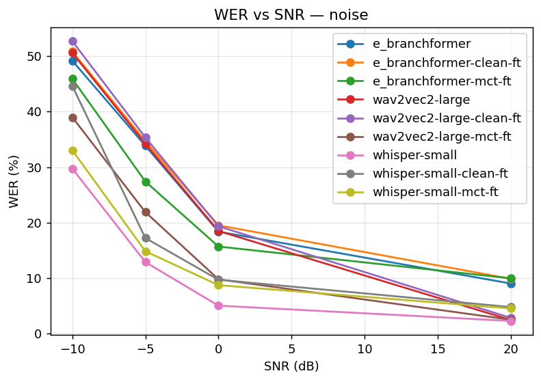
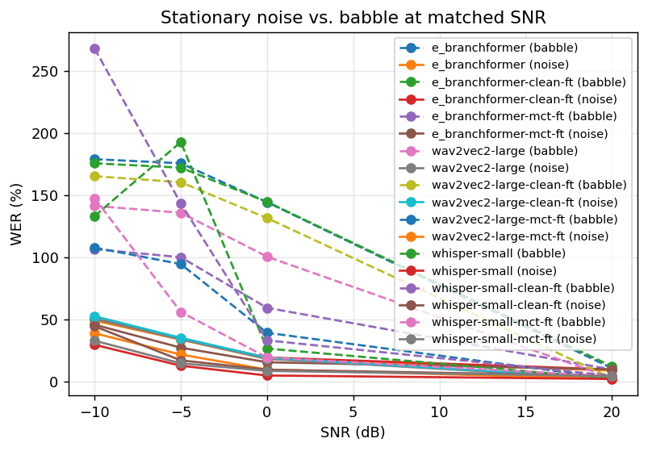
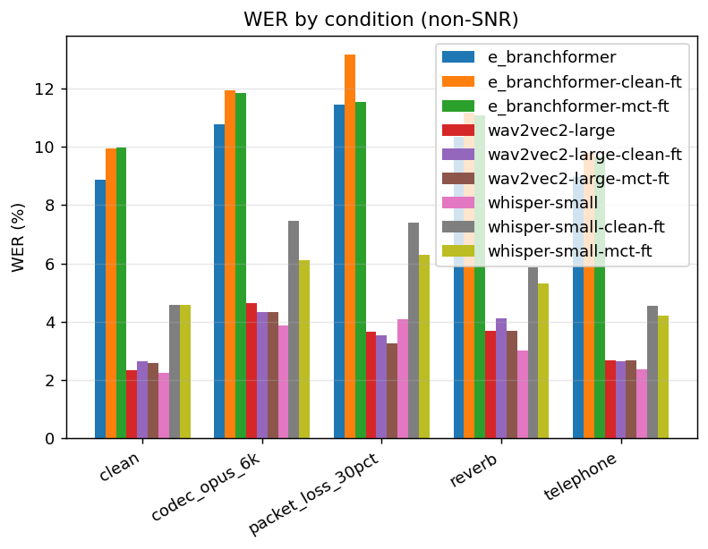
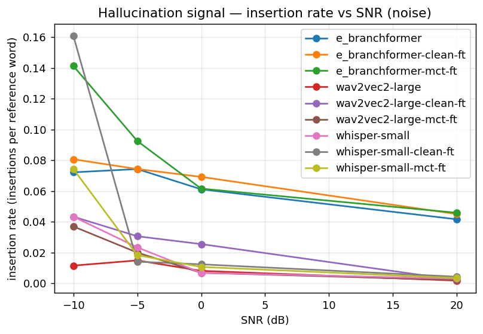

# ASR Robustness Under Acoustic Degradation — Results

Source: `results/ft_ablation.jsonl` — 144 (model, condition) summaries

## WER (%) by model × condition

| model | babble_-10db | babble_-5db | babble_0db | babble_20db | cellphone_in_crowd_-5db | clean | codec_opus_6k | far_field_surveillance_-5db | noise_-10db | noise_-5db | noise_0db | noise_20db | packet_loss_30pct | reverb | telephone | walkie_talkie_0db |
| --- | --- | --- | --- | --- | --- | --- | --- | --- | --- | --- | --- | --- | --- | --- | --- | --- |
| e_branchformer | 179.0 | 175.6 | 144.4 | 10.9 | 136.4 | 8.9 | 10.8 | 177.3 | 49.2 | 33.9 | 18.4 | 9.0 | 11.5 | 10.4 | 9.0 | 23.2 |
| e_branchformer-clean-ft | 175.6 | 172.1 | 144.6 | 12.4 | 129.9 | 9.9 | 11.9 | 173.6 | 50.8 | 34.7 | 19.5 | 9.9 | 13.2 | 11.2 | 9.8 | 24.6 |
| e_branchformer-mct-ft | 106.6 | 100.1 | 59.4 | 9.8 | 104.5 | 10.0 | 11.8 | 107.4 | 45.9 | 27.4 | 15.7 | 10.0 | 11.5 | 11.1 | 9.7 | 21.8 |
| wav2vec2-large | 141.4 | 135.9 | 100.6 | 3.1 | 113.8 | 2.3 | 4.6 | 142.2 | 50.6 | 34.2 | 18.5 | 2.5 | 3.6 | 3.7 | 2.7 | 23.2 |
| wav2vec2-large-clean-ft | 165.3 | 160.4 | 131.6 | 2.9 | 149.9 | 2.6 | 4.3 | 164.1 | 52.7 | 35.3 | 19.3 | 2.8 | 3.5 | 4.1 | 2.6 | 23.7 |
| wav2vec2-large-mct-ft | 107.9 | 94.6 | 39.4 | 2.7 | 109.0 | 2.6 | 4.3 | 107.1 | 39.0 | 21.9 | 9.8 | 2.5 | 3.3 | 3.7 | 2.7 | 12.6 |
| whisper-small | 133.2 | 192.7 | 26.7 | 2.5 | 178.7 | 2.2 | 3.9 | 168.1 | 29.7 | 12.9 | 5.0 | 2.3 | 4.1 | 3.0 | 2.4 | 8.2 |
| whisper-small-clean-ft | 267.9 | 143.4 | 33.3 | 4.8 | 257.6 | 4.6 | 7.5 | 201.7 | 44.6 | 17.2 | 9.7 | 4.8 | 7.4 | 5.9 | 4.5 | 13.0 |
| whisper-small-mct-ft | 147.6 | 56.1 | 19.5 | 4.4 | 119.0 | 4.6 | 6.1 | 95.3 | 33.1 | 14.8 | 8.7 | 4.5 | 6.3 | 5.3 | 4.2 | 10.4 |

### WER vs SNR

### Stationary noise vs babble

### Conditions (non-SNR)

### Hallucination signal

