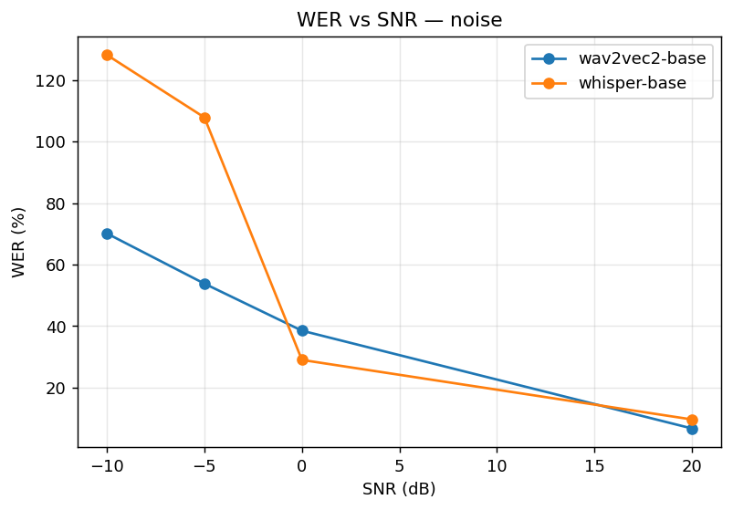
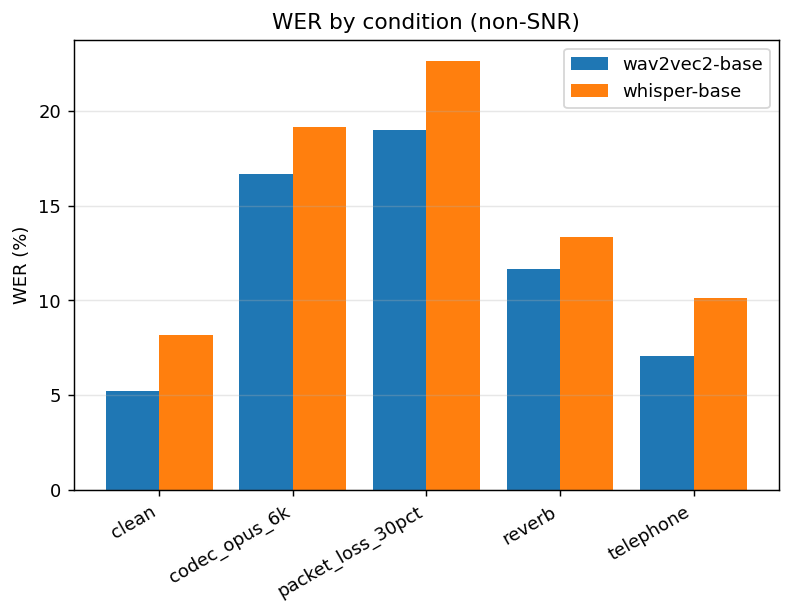

# ASR Robustness Under Acoustic Degradation — Results

Source: `results/pilot.jsonl` — 32 (model, condition) summaries

## WER (%) by model × condition

| model | babble_-10db | babble_-5db | babble_0db | babble_20db | cellphone_in_crowd_-5db | clean | codec_opus_6k | far_field_surveillance_-5db | noise_-10db | noise_-5db | noise_0db | noise_20db | packet_loss_30pct | reverb | telephone | walkie_talkie_0db |
| --- | --- | --- | --- | --- | --- | --- | --- | --- | --- | --- | --- | --- | --- | --- | --- | --- |
| wav2vec2-base | 125.5 | 125.4 | 119.0 | 7.8 | 101.9 | 5.2 | 16.7 | 123.4 | 70.2 | 53.8 | 38.5 | 6.7 | 19.0 | 11.7 | 7.1 | 54.7 |
| whisper-base | 324.6 | 234.6 | 175.0 | 10.9 | 420.9 | 8.2 | 19.1 | 178.8 | 128.2 | 107.9 | 29.0 | 9.6 | 22.6 | 13.3 | 10.1 | 60.6 |

### WER vs SNR

### Stationary noise vs babble

### Conditions (non-SNR)

### Hallucination signal

