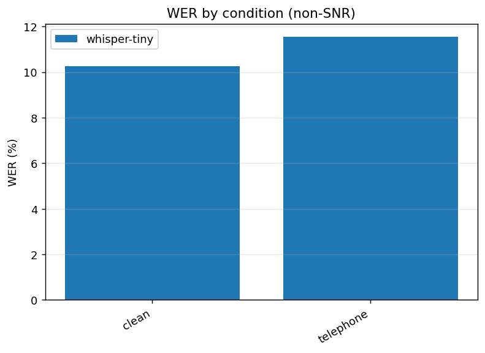

# ASR Robustness Under Acoustic Degradation — Results

Source: `results/smoke.jsonl` — 2 (model, condition) summaries

## WER (%) by model × condition

| model | clean | telephone |
| --- | --- | --- |
| whisper-tiny | 10.3 | 11.5 |

### Conditions (non-SNR)

